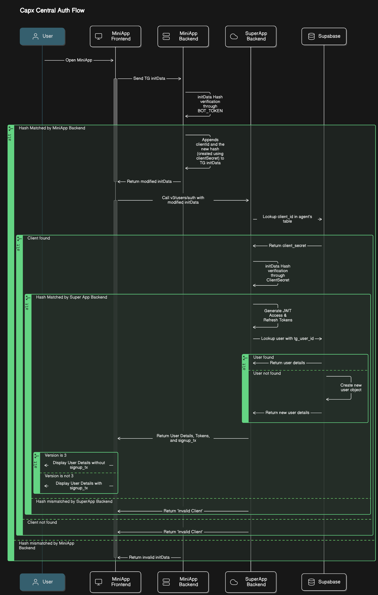

# Capx SuperApp

## Overview

Welcome to the Capx SuperApp! This application is a platform hosting a diverse ecosystem of AI agents, each designed for specific tasks and functionalities. Think of it as a central hub where you can interact with a variety of specialized AI assistants. Some of these agents even have their own dedicated tokens, creating unique micro-economies within the SuperApp.

## What is the Capx SuperApp?

The Capx SuperApp is designed to be a unified platform for accessing multiple AI-powered services. Instead of having separate applications for different AI tools, the SuperApp brings them together in one convenient location. This allows for seamless interaction and potential synergies between different AI agents. Each agent within the SuperApp is built to excel in a particular area, providing users with a powerful and versatile toolkit. The use of individual agent tokens, where applicable, adds another layer of functionality and potentially allows for novel interaction models and incentivization structures.

## Key Features

*   **Diverse AI Agents:** Access a wide range of AI agents, each specializing in different tasks.
*   **Unified Platform:** Interact with multiple AI agents in a single, integrated environment.
*   **Agent-Specific Tokens :** Certain agents may utilize their own tokens, enabling unique functionalities and economic models within the SuperApp.
*   **Streamlined User Experience:** Enjoy a consistent and intuitive interface for interacting with all agents.
*   **Scalable Architecture:** The SuperApp is designed to accommodate a growing number of AI agents and features.
*   **Integrated Blockchain Capabilities:** Manage digital assets, including ERC20 tokens and NFTs (ERC721), with built-in wallet support.
*   **Marketplace for AI Agents:** Discover, create, and trade AI agents.
*   **Engagement Systems:** Participate in quests, challenges, and daily spins to earn rewards.
*   **Secure Authentication:** Robust JWT-based authentication with RS256 algorithm.
*   **Multi-Level Referral System:** Earn rewards by inviting new users to the platform.

## Main Components & Backend Architecture

The Capx SuperApp is built upon a robust and scalable backend, featuring several key components:

1.  **Capx Auth (Authentication System):**

    *   **Secure Authentication:** Capx Auth utilizes a JWT (JSON Web Token)-based authentication mechanism with the RS256 algorithm. This ensures secure and standardized user authentication.
    *   **How it Works:**
        1.  **Login:** Users initiate login through the `/login` endpoint, providing their credentials (e.g., email/password, social login).  The system supports various login methods, including traditional email/password, social logins (Google, Facebook, etc.), and potentially even Web3 wallet logins.
        2.  **Token Generation:** Upon successful authentication, Capx Auth generates two tokens:
            *   **Access Token:** A short-lived token (e.g., 15 minutes) used for authorizing API requests.
            *   **Refresh Token:** A longer-lived token (e.g., 7 days) used to obtain new access tokens without requiring re-authentication.
            These tokens are digitally signed using a private key based on the RS256 algorithm (RSA Signature with SHA-256).  This signature guarantees the token's integrity and authenticity.
        3.  **Token Usage:** The client (SuperApp frontend) stores these tokens (typically in HTTP-only cookies for enhanced security).  For each API request requiring authorization, the client includes the *access token* in the `Authorization` header as a Bearer token (e.g., `Authorization: Bearer <access_token>`).
        4.  **Token Verification:** The backend (resource server) verifies the access token on each request:
            *   **Signature Verification:** It retrieves the corresponding public key from the Capx Auth server's JWKS endpoint.  Using this public key, it verifies the digital signature of the JWT. This confirms that the token was issued by the Capx Auth server and hasn't been tampered with.
            *   **Expiration Check:** It checks the `exp` (expiration) claim within the token to ensure it's not expired.
            *   **Audience and Issuer Check:**  It verifies the `aud` (audience) and `iss` (issuer) claims to ensure the token is intended for the correct resource server and was issued by the expected authority.
        5.  **Refresh Token:** When the access token expires, the client uses the refresh token to request a new access token from the `/refresh` endpoint.  The refresh token is sent in the request body.  Capx Auth validates the refresh token (signature, expiration) and, if valid, issues a new access token and potentially a new refresh token. This process happens seamlessly in the background, without user intervention.
        6. **Role Based Access Control (RBAC):**  The system incorporates role-based access control.  JWTs can contain a `roles` claim, which specifies the user's permissions (e.g., `user`, `admin`, `moderator`). The backend uses these roles to authorize access to specific resources and functionalities.  For example, only users with the `admin` role might be allowed to create new AI agents.
    *   **JWKS Endpoint:** Capx Auth provides a JSON Web Key Set (JWKS) endpoint (typically `/jwks.json`). This endpoint publicly exposes the public keys used to verify the JWT signatures.  This is a standard mechanism for securely sharing public keys in a JWT-based authentication system. Resource servers use this endpoint to fetch the public keys without needing to share secrets directly with the authentication server.
    *   **Security:** RS256 uses asymmetric encryption (a private key for signing and a public key for verification). This is a highly secure cryptographic algorithm widely used for JWT authentication. The private key is kept secret on the Capx Auth server, while the public key is made available via the JWKS endpoint.
    * **Working Diagram:**
    

2.  **Referral System:**

    *   **Multi-Level Structure:** A sophisticated multi-level referral system encourages user growth. Users can generate unique referral codes and share them.
    *   **Automated Tracking:** The system automatically tracks and attributes referrals when new users join via referral links.
    *   **Reward Distribution:** Rewards are distributed across multiple levels of the referral chain.
    *   **Analytics & Reporting:** Comprehensive analytics allow users to track referral performance and earnings.

3.  **Wallet Integration:**

    *   **Multi-Chain Support:** Seamless blockchain integration supporting multiple chains and token standards (ERC20, ERC721).
    *   **Asset Management:** Users can manage their digital assets (tokens and NFTs) directly within the platform.
    *   **Real-Time Tracking:** Real-time balance tracking and transaction history are provided.

4.  **Store and Marketplace:**

    *   **AI Agent Interaction:** A marketplace for users to interact with, create, and trade AI agents.
    *   **Dynamic Pricing:** A dynamic pricing system based on market demand for agents.
    *   **Trending Agents:** Tracking of trending agents.

5.  **Quest and Engagement Systems:**

    *   **Challenges & Tasks:** Users can participate in quests and challenges to earn rewards.
    *   **Leaderboard:** A leaderboard tracks user achievements and progress.
    *   **Daily Spin:** A daily spin mechanism adds a gamified element for regular engagement.

6.  **Transaction and Payment Processing:**

    *   **Top-Up System:** A robust system for managing credits and payments.
    *   **Secure Processing:** Secure processing and recording of all transactions.
    *   **Transaction History:** Detailed transaction histories and receipt management.

## Future Development

The Capx SuperApp is a constantly evolving platform. Future development plans include:

*   **Adding new AI agents:** Continuously expanding the range of available agents and functionalities.
*   **Enhanced agent interoperability:** Improving the ability of different agents to interact and collaborate.
*   **Refined tokenomics:** Further developing the economic models for agent-specific tokens.
*   **Community features:** Introducing features that allow users to connect and collaborate.
*   **Open API:** Allowing third party developers to create and integrate their own AI agents.